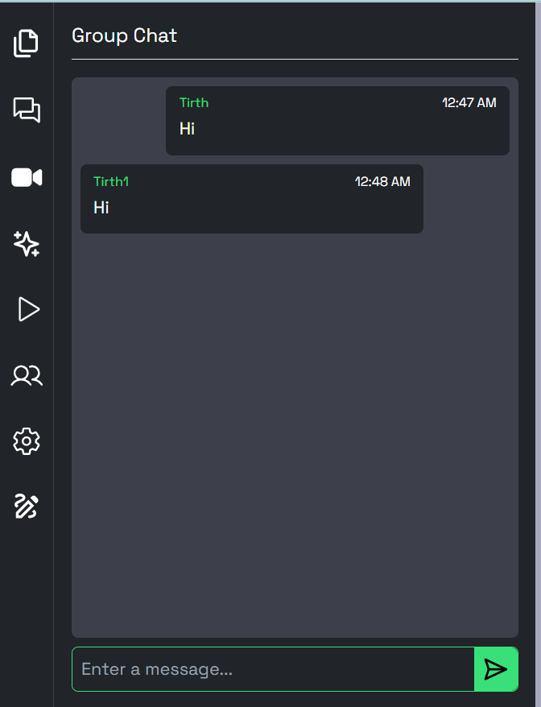
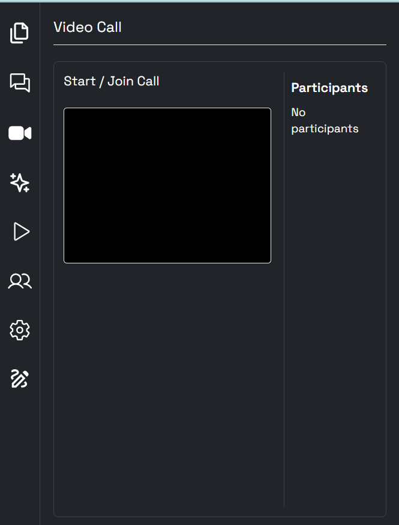
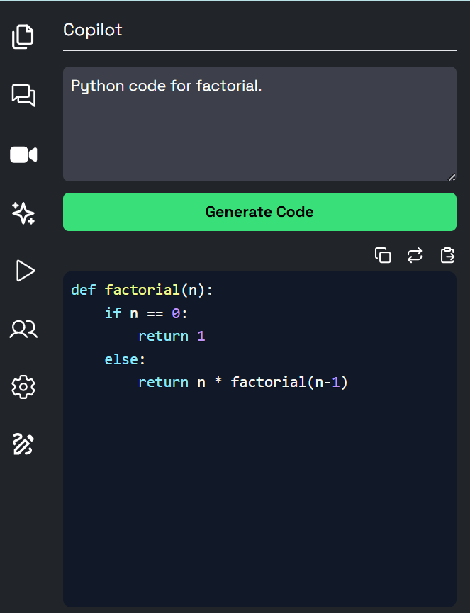
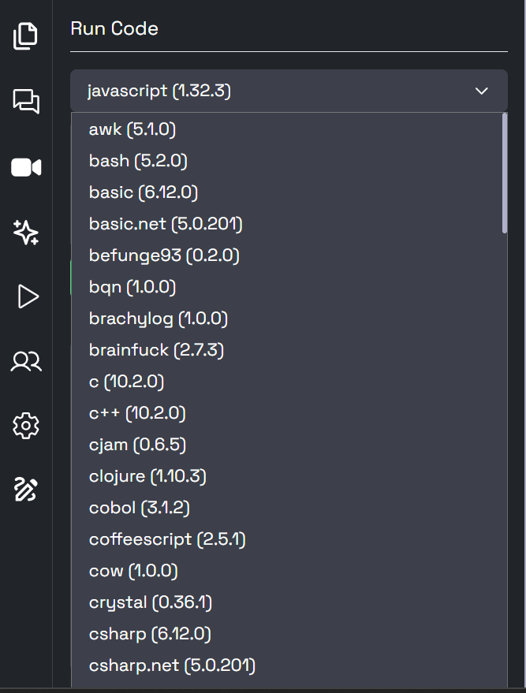
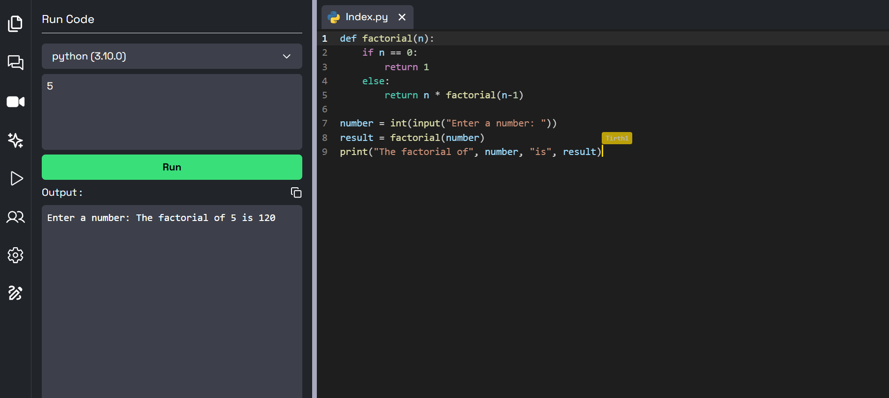
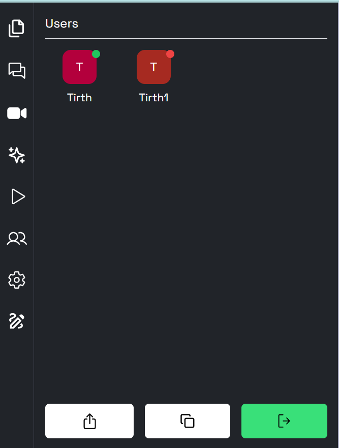
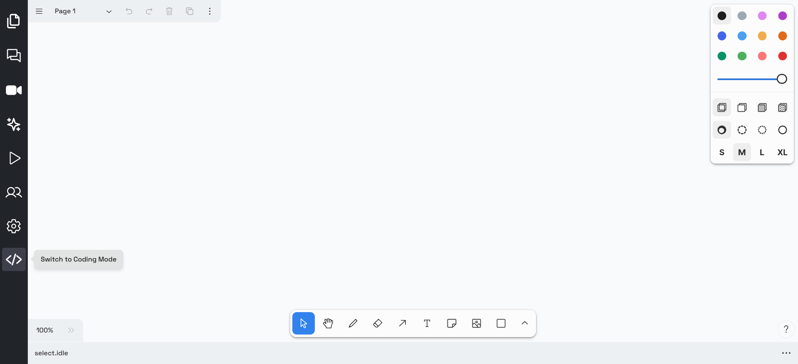

# Code Collaborate — Real-Time Collaborative Code Editor

Code Collaborate is a powerful, production-ready real-time collaborative IDE built with TypeScript. It lets teams and learners instantly create or join room-based sessions to edit code together, run programs in 70+ languages, and collaborate naturally with built-in chat, video calls, live cursor presence, AI code generation, file management, and a drawing canvas — all from the browser.

## 🔮 Features

- 💻 Real-time collaboration on code editing across multiple files
- 📁 Create, open, edit, save, delete, and organize files and folders
- 💾 Option to download the entire codebase as a zip file
- 🚀 Unique room generation with room ID for collaboration
- 🌍 Comprehensive language support for versatile programming
- 🌈 Syntax highlighting for various file types with auto-language detection
- 🚀 Code Execution: Users can execute the code directly within the collaboration environment
- ⏱️ Instant updates and synchronization of code changes across all files and folders
- 📣 Notifications for user join and leave events
- 👥 User presence list with online/offline status indicators
- 💬 Real-time group chatting and video call functionality
- 🎩 Real-time tooltip displaying users currently editing.
- 🖊 Showing real-time selection of what each user has currently selected.
- 💡 Auto-suggestion based on programming language
- 🔠 Option to change font size and font family
- 🎨 Multiple themes for personalized coding experience
- 🎨 Collaborative Drawing: Enable users to draw and sketch collaboratively in real-time
- 🤖 Copilot: An AI-powered assistant that generates code, allowing you to insert, copy, or replace content seamlessly within your files.

## 🎯 Preview

### 1. Create or Join a Room

### 2. Code Editor & File Management

### 3. Real-Time Team Chat

### 4. Video Collaboration

### 5. AI Copilot

### 6. Run 70+ Programming Languages

### 7. Integrated Terminal

### 8. Room Members & Invite Link

### 9. Editor Settings & Themes

### 10. Collaborative Drawing Mode

